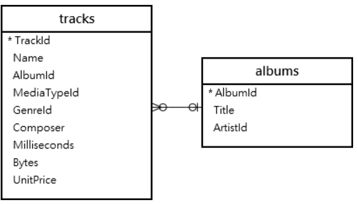

# SQLITE GROUP BY 


The `GROUP BY` clause is an optional clause of the `SELECT` statement. The `GROUP BY` clause a selected group of rows into summary rows by values of one or more columns<br />
The following statement illustrates the syntax of the SQLite `GROUP BY` clause 

```SQL
SELECT 
    column_1,
    aggregate_funciton(column_2)
FROM
    table
GROUP BY 
    column_1,
    column_2;
    
```


## a simple examples


```SQL
SELECT 
    albumid,
    COUNT(trackid)
FROM 
    tracks
GROUP BY 
    albumid;
```

The above SQL statement just aggregate  the  track that have same albumid . And show the number of tracks corresponding to each album.  

And you also can use `ORDER BY` sort the result sets accroding to `COUNT(trackid)`

```SQL
SELECT 
    albumid,
    COUNT(trackid)
FROM 
    tracks
GROUP BY 
    albumid
ORDER BY 
    COUNT(trackid)
```

## SQLITE `GROUP BY` and `INNER JOIN` clause 




```SQL
SELECT 
    tracks.albumid,
    title,
    COUNT(trackid)
FROM
    tracks
INNER JOIN albums ON albums.albumid = tracks.albumid
GROUP BY 
    tracks.albumid;
```

The above SQL statement just  aggregate  the  track that have same albumid. Show the number of tracks ,And also show the title of album from another relational tables. 

## SQLITE `GROUP BY` and `SUM` function example 


```SQL
SELECT
	albumid,
	SUM(milliseconds) length,
	SUM(bytes) size
FROM
	tracks
GROUP BY
	albumid;
```

The above SQL statement just aggregate the track that have same albumid. Each album correspond many tracks, `SUM(milliseconds)` will calculate all the tracks playing time. `SUM(bytes)` will calculate the amount of all the tracks storage occupied.

We can also use `MAX` , `MIN`, and `AVG` got more information about every group 

## SQLITE `GROUP BY date` example 

```SQL 
SELECT 
    STRTIME('%Y', InvoiceDate) InvoiceYear,
    COUNT(InvoiceId) InvoiceCount
FROM
   invoices
GROUP BY
   STRFTIME('%Y', InvoiceDate)
ORDER BY
   InvoiceYear;    
```

The `invoices` table used for storing the message about invoices. Such as `Invoice date, Billing city , Billing address, Billing country , etc`. The above SQL statement just orgranized invoices that are in the same year. And sort by `invoice year`. And show the count of invoices every year. 

`STRFTIME('%Y', InvoiceDate)` return a year from a date string 


